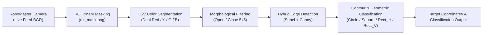
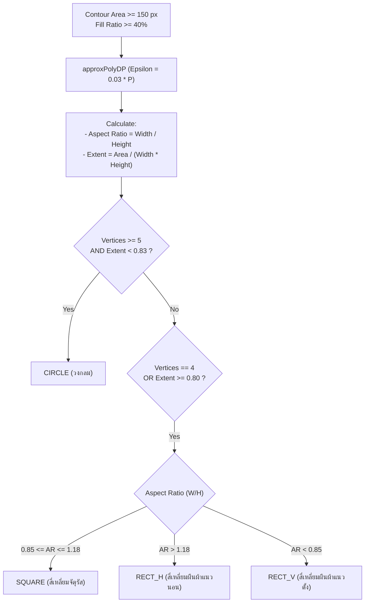

# คู่มือและรายงานทางเทคนิค: ระบบตรวจจับเป้าหมายด้วยภาพและการปรับแต่งสี (Camera Detection Module)

เอกสารฉบับนี้อธิบายระบบคอมพิวเตอร์วิทัศน์ (Computer Vision) การประมวลผลภาพ การจัดหมวดหมู่รูปทรงเรขาคณิต และเครื่องมือปรับแต่งค่าสีและพื้นที่สนใจ (ROI) ในโฟลเดอร์ `Report_final/Camera_Detection` สำหรับหุ่นยนต์ **RoboMaster EP**

---

## 1. วัตถุประสงค์และภาพรวมระบบ (System Overview)

ระบบตรวจจับภาพทำหน้าที่ระบุตำแหน่ง รูปทรงเรขาคณิต และสีของเป้าหมายในสนามเขาวงกต ซึ่งติดอยู่บนกำแพงตามข้อกำหนดการแข่งขัน:



### สเปกของเป้าหมายในสนาม (Target Specifications)
- **สีของเป้าหมาย (4 สี)**: สีแดง (Red), สีเหลือง (Yellow), สีเขียว (Green), สีน้ำเงิน (Blue)
- **รูปทรงเรขาคณิต (4 รูปแบบ)**:
  1. สี่เหลี่ยมจัตุรัส (Square): ขนาด $7 \times 7\text{ cm}$ (Aspect Ratio $\approx 1.0$)
  2. สี่เหลี่ยมผืนผ้าแนวนอน (Horizontal Rect - `RECT_H`): ขนาด $9 \times 6\text{ cm}$ (Aspect Ratio $\approx 1.5$)
  3. สี่เหลี่ยมผืนผ้าแนวตั้ง (Vertical Rect - `RECT_V`): ขนาด $6 \times 9\text{ cm}$ (Aspect Ratio $\approx 0.67$)
  4. วงกลม (Circle): เส้นผ่านศูนย์กลาง $\varnothing 7\text{ cm}$

---

## 2. โครงสร้างไฟล์ในโฟลเดอร์ `Camera_Detection`

| ชื่อไฟล์ | หน้าที่และการทำงาน |
|:---|:---|
| `color_cali_up_v1.py` | โปรแกรมหลักสำหรับปรับค่า HSV แบบ Real-time, ระบบ Drag-to-Select ROI Mask, การวิเคราะห์รูปทรงเรขาคณิตสด, และการควบคุม Gimbal หมุน 4 ทิศทาง |
| `color_calibration.py` | โปรแกรมปรับเทียบสีและทดสอบ Edge Detection แบบลดภาระ CPU (Downscaled Resolution) |
| `clean.py` | เครื่องมือสแตนด์อโลนสำหรับวาด/ลบ/แก้ไขภาพ Mask (`roi_mask.png`) ด้วยเมาส์ |
| `hsv_config.json` | ฐานข้อมูลค่าขอบเขตสี (Hue, Saturation, Value) สำหรับทั้ง 4 สี |
| `roi_mask.png` | ภาพไบนารีมาสก์ (255 = พื้นที่ใช้งาน, 0 = ตัดทิ้ง) เพื่อตัดพื้น/ขอบล้อ/แชสซีที่ไม่ต้องการ |
| `roi_config.json` | พารามิเตอร์ขอบเขต ROI สำรอง |
| `tof_calib_params.json` | พารามิเตอร์การชดเชยระยะ ToF สำหรับประเมินความลึก |

---

## 3. ทฤษฎีและอัลกอริทึมการประมวลผลภาพ (Computer Vision Pipeline)

---

### 3.1 การแปลงปริภูมิสีและ Dual-Band Red HSV Filtering

เนื่องจากสีแดงในระบบสี HSV อยู่คร่อมรอยต่อของค่า Hue ที่ช่วงเริ่มต้น ($0^\circ-10^\circ$) และช่วงปลาย ($165^\circ-180^\circ$) ระบบจึงใช้การกรองแบบ 2 ช่วง (Dual-Range) แล้วนำมารวมกันด้วยการทำ $\text{Bitwise-OR}$:

$$\text{Mask}_{\text{Red}} = \text{inRange}(\text{HSV}, \text{Lower}_1, \text{Upper}_1) \lor \text{inRange}(\text{HSV}, \text{Lower}_2, \text{Upper}_2)$$

สำหรับสีอื่น ๆ (Yellow, Green, Blue) ใช้ขอบเขตสีแบบช่วงเดียว ($\text{Single Range}$):

$$\text{Mask}_{\text{Color}} = \text{inRange}(\text{HSV}, \text{Lower}, \text{Upper})$$

---

### 3.2 การตัดสัญญาณรบกวน (Morphological Noise Removal)

ใช้โครงสร้าง Kernel ขนาด $5 \times 5$ พิกเซล ผ่านกระบวนการ:
1. **Morphological Opening**: เพื่อกำจัดจุดรบกวนขนาดเล็ก (Noise Specs)
   $$\text{Open}(A) = (A \ominus B) \oplus B$$
2. **Morphological Closing**: เพื่อเชื่อมช่องว่างภายในรูปทรงให้ทึบสมบูรณ์
   $$\text{Close}(A) = (A \oplus B) \ominus B$$

---

### 3.3 Hybrid Edge Detection (Sobel + Canny)

เพื่อขอบเขตที่คมชัดและลดการขาดตอนของเส้นขอบ:
1. แปลงภาพเป็น Grayscale และทำ Gaussian Blur ขนาด $5 \times 5$
2. คำนวณความชันเกรเดียนต์ด้วย **Sobel Operator** ในแนวแกน $X$ และ $Y$:
   $$G = \sqrt{G_x^2 + G_y^2}$$
3. หาเส้นขอบด้วย **Canny Edge Detection** (Threshold: 50, 150)
4. ผสานสองเส้นขอบด้วย $\text{Bitwise-OR}$:
   $$\text{Edges}_{\text{Combined}} = \text{Sobel}_{\text{Edges}} \lor \text{Canny}_{\text{Edges}}$$

---

### 3.4 การจำแนกรูปทรงเรขาคณิต (Geometric Shape Classification)



#### คุณสมบัติทางคณิตศาสตร์ที่ใช้ตัดสิน:
1. **Fill Ratio (ความหนาแน่นของเม็ดสีเป้าหมาย)**:
   $$\text{Fill Ratio} = \frac{\text{CountNonZero}(\text{BBox\_Mask})}{\text{Width} \times \text{Height}} \times 100\% \ge 40\%$$
2. **Aspect Ratio (อัตราส่วนด้านกว้างต่อด้านยาว)**:
   $$\text{Aspect Ratio} = \frac{W}{H}$$
3. **Extent (อัตราส่วนพื้นที่จริงต่อพื้นที่กรอบสี่เหลี่ยมล้อมรอบ)**:
   $$\text{Extent} = \frac{\text{Contour Area}}{W \times H}$$
   *(วงกลมตามทฤษฎีจะมี $\text{Extent} = \frac{\pi r^2}{4 r^2} = \frac{\pi}{4} \approx 0.785 < 0.83$ ส่วนสี่เหลี่ยมจะมี $\text{Extent} \approx 1.0$)*

---

## 4. คู่มือการใช้งานเครื่องมือในโมดูล

### 4.1 การใช้งาน `color_cali_up_v1.py`

#### คีย์ลัดในการจัดการ ROI (พื้นที่สนใจ):
- `[R]`: เข้าโหมด **Drag Paint** (คลิกเมาส์ซ้ายค้างลากสี่เหลี่ยม เพื่อเปิดพื้นที่มองเห็น - ค่าพิกเซล 255)
- `[E]`: เข้าโหมด **Drag Eraser** (คลิกเมาส์ซ้ายค้างลาก เพื่อถมสีดำลบสิ่งรบกวน - ค่าพิกเซล 0)
- `[I]`: เปิดทั้งภาพเป็นสีขาวทั้งหมด (Invert / Select All)
- `[C]`: เคลียร์ทั้งภาพเป็นสีดำทั้งหมด (Clear All)

#### คีย์ลัดในการปรับเทียบสี HSV:
- `[1]`: เลือกปรับ **RED Range 1** (Low Hue)
- `[5]`: เลือกปรับ **RED Range 2** (High Hue)
- `[2]`: เลือกปรับ **YELLOW**
- `[3]`: เลือกปรับ **GREEN**
- `[4]`: เลือกปรับ **BLUE**

#### คีย์ลัดควบคุม Gimbal และระบบแสดงผล:
- `[W]`: หันหน้า ($0^\circ$)
- `[A]`: หันซ้าย ($-90^\circ$)
- `[D]`: หันขวา ($+90^\circ$)
- `[X]`: หันหลัง ($180^\circ$)
- `[M]`: สลับมุมมองฟิลเตอร์ (`COLOR_RESULT` $\rightarrow$ `MASK` $\rightarrow$ `SOBEL` $\rightarrow$ `CANNY` $\rightarrow$ `RAW`)
- `[S]`: บันทึกการตั้งค่าลง `hsv_config.json` และ `roi_mask.png` ทันที
- `[Q]`: ออกจากโปรแกรม

---

### 4.2 การใช้งาน `clean.py` (Mask Cleanup Utility)
ใช้เมื่อต้องการแก้ไขไฟล์ `roi_mask.png` ที่บันทึกไว้ล่วงหน้าโดยไม่ต้องเปิดเชื่อมต่อหุ่นยนต์
- **คลิกซ้ายค้างแล้วลาก**: เติมสีขาว (เปิดพื้นที่)
- **คลิกขวาค้างแล้วลาก**: เติมสีดำ (ลบพื้นที่ทิ้งทันที)
- `[S]`: เซฟทับลง `mask_updated.png` หรือ `roi_mask.png`

---

## 5. ตัวอย่างโครงสร้างไฟล์ `hsv_config.json`

```json
{
    "red": [
        {"lower": [0, 90, 70], "upper": [12, 255, 255]},
        {"lower": [165, 90, 70], "upper": [180, 255, 255]}
    ],
    "yellow": [
        {"lower": [15, 100, 100], "upper": [35, 255, 255]}
    ],
    "green": [
        {"lower": [35, 70, 50], "upper": [85, 255, 255]}
    ],
    "blue": [
        {"lower": [95, 80, 50], "upper": [135, 255, 255]}
    ]
}
```
