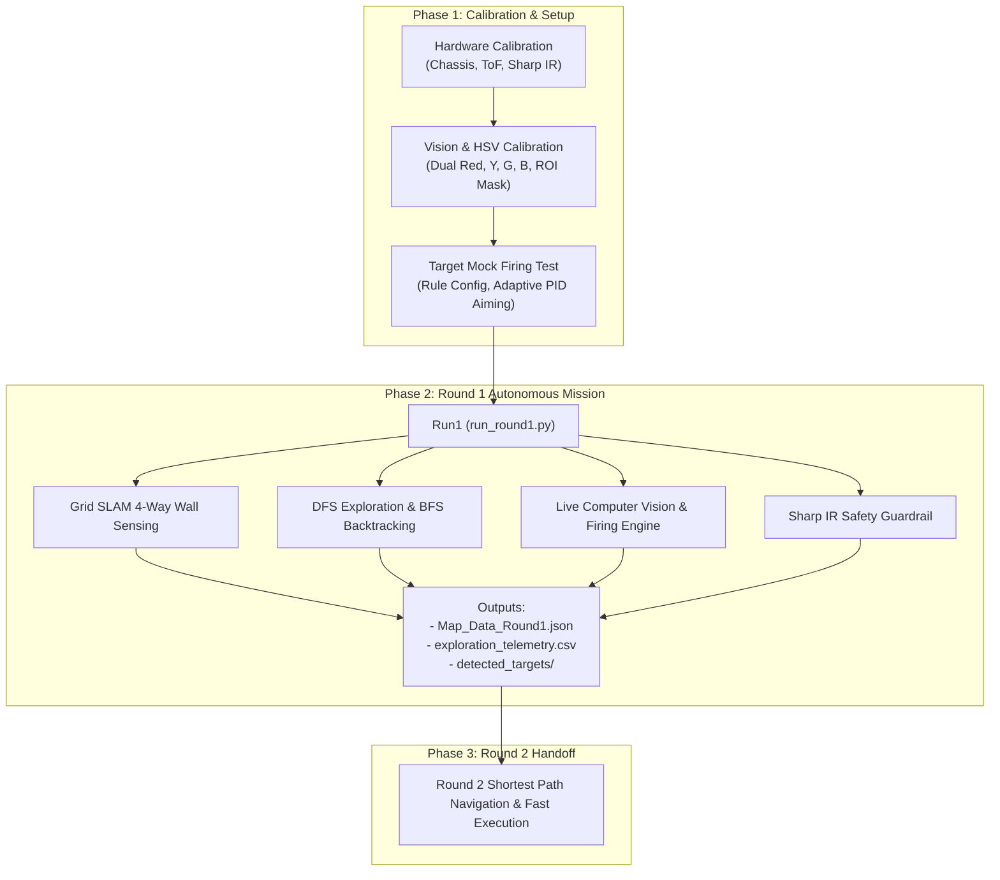

# รายงานฉบับสมบูรณ์: สถาปัตยกรรมระบบหุ่นยนต์อัตโนมัติ RoboMaster EP สำหรับการสำรวจเขาวงกตและยิงเป้าหมาย (Master Technical Documentation)

เอกสารฉบับนี้เป็นเอกสารหลัก (Master Document) รวบรวมคำอธิบายการทำงานของระบบหุ่นยนต์ **RoboMaster EP** ในโฟลเดอร์ `Report_final` สำหรับนำไปใช้จัดทำรายงานโครงงานทางวิศวกรรมและการแข่งขันเขาวงกต

---

## 1. ภาพรวมของโครงการ (Executive Summary)

โครงการนี้มุ่งเน้นการพัฒนาระบบอัตโนมัติเต็มรูปแบบสำหรับหุ่นยนต์ **DJI RoboMaster EP** เพื่อปฏิบัติภารกิจในเขาวงกตขนาดช่องกริด $60 \times 60\text{ cm}$ โดยแบ่งการทำงานออกเป็น 2 รอบ:
- **รอบที่ 1 (Round 1 - Exploration & Elimination)**: เคลื่อนที่สำรวจเขาวงกตอัตโนมัติ สร้างแผนที่ดิจิทัล (Digital SLAM Map) ระบุรูปทรงและสีของเป้าหมายบนกำแพง เล็งยิงเป้าหมายที่ตรงตามกติกาให้ล้มทั้งหมด และนำทางกลับจุดเริ่มต้น $(0, 0)$
- **รอบที่ 2 (Round 2 - Shortest Path Fast Firing)**: โหลดข้อมูลแผนที่และพิกัดเป้าหมายจากรอบที่ 1 เพื่อคำนวณเส้นทางที่สั้นที่สุด (Global Shortest Path) และขับเคลื่อนไปยิงเป้าหมายที่เหลือให้ครบในเวลาที่เร็วที่สุด

---

## 2. ข้อมูลจำเพาะทางกายภาพและสนาม (Physical & Environmental Specifications)

### 2.1 มิติและตำแหน่งเซนเซอร์ของหุ่นยนต์ (Robot Dimensions & Sensors)
- **ขนาดตัวหุ่นยนต์**: ความยาวประมาณ $33\text{ cm}$, ความกว้างประมาณ $25\text{ cm}$
- **ความสูงจากพื้นถึงแกนหมุน Gimbal**: $22\text{ cm}$
- **เซนเซอร์ Time-of-Flight (ToF)**: ติดตั้งบน Gimbal ยื่นห่างจากแกนหมุน $7.5\text{ cm}$ สูงจากแกนหมุน $6.5\text{ cm}$ (ใช้สแกนกำแพง 4 ทิศทาง)
- **กล้อง (Main Camera)**: ติดตั้งบน Gimbal ยื่นห่างจากแกนหมุน $7.5\text{ cm}$ สูงจากแกนหมุน $3.5\text{ cm}$
- **เซนเซอร์ Sharp Infrared (IR)**:
  - ฝั่งขวา (Right Sensor): Adapter ID: 1, Port: 1
  - ฝั่งซ้าย (Left Sensor): Adapter ID: 2, Port: 1
  - หน้าที่: ตรวจจับระยะด้านข้างเพื่อเป็น Guardrail ป้องกันการครูดชนกำแพง

### 2.2 มิติสนามเขาวงกต (Arena Specifications)
- **ขนาดช่องกริด (Grid Cell)**: $60 \times 60\text{ cm}$
- **ความหนากำแพง**: ประมาณ $7.5\text{ cm}$
- **ความสูงกำแพง**: $30\text{ cm}$
- **ความกว้างช่องทางเดิน**: $60\text{ cm}$

### 2.3 สเปกของเป้าหมายที่ต้องยิง (Target Specifications)
- **รูปทรงเรขาคณิต (4 แบบ)**:
  1. สี่เหลี่ยมจัตุรัส (`SQUARE`): ขนาด $7 \times 7\text{ cm}$
  2. สี่เหลี่ยมผืนผ้าแนวนอน (`RECT_H`): ขนาด $9 \times 6\text{ cm}$
  3. สี่เหลี่ยมผืนผ้าแนวตั้ง (`RECT_V`): ขนาด $6 \times 9\text{ cm}$
  4. วงกลม (`CIRCLE`): เส้นผ่านศูนย์กลาง $\varnothing 7\text{ cm}$
- **สีเป้าหมาย (4 สี)**: สีแดง (Red), สีเหลือง (Yellow), สีเขียว (Green), สีน้ำเงิน (Blue)

---

## 3. ตารางสรุปเทคโนโลยีและอัลกอริทึมที่ใช้ (Key Technology Matrix)

| โมดูล / ระบบย่อย | อัลกอริทึม / เทคนิคทางคณิตศาสตร์ | วัตถุประสงค์หลัก |
|:---|:---|:---|
| **Chassis Motion Control** | Proportional Yaw Holding + Ramp-down Profile | ควบคุมหุ่นยนต์วิ่งตรงแนว $0^\circ$ ไม่หมุนส่าย และชะลอความเร็วเพื่อหยุดตรงกึ่งกลางช่อง |
| **Safety Guardrail** | Sharp IR Quadratic Conversion + Strafe Correction | ป้องกันหุ่นยนต์ครูดกำแพงเมื่อระยะด้านข้างน้อยกว่า $11\text{ cm}$ |
| **Wall Detection** | Gimbal 4-Way Scanning + ToF Quadratic Compensation | ตรวจสอบกำแพงทั้ง 4 ด้าน ($0^\circ, 90^\circ, 180^\circ, -90^\circ$) ด้วยระยะ Threshold $52\text{ cm}$ |
| **Computer Vision** | Dual-Range HSV + Morphological Filter + Sobel/Canny | สกัดสีเป้าหมายอย่างแม่นยำแม้ในสภาพแสงรบกวน |
| **Shape Classification** | `approxPolyDP` + Aspect Ratio + Extent + Fill Ratio | แยกแยะสี่เหลี่ยมจัตุรัส ผืนผ้าแนวตั้ง แนวนอน และวงกลม |
| **Gimbal Visual Servoing** | Adaptive-Speed Closed Loop Control | เล็งเป้าหมายรวดเร็วเมื่อระยะไกล และละเอียดนุ่มนวลเมื่อเข้าใกล้จุดเล็ง $\pm 18\text{ px}$ |
| **Target Double-fire Prevention** | Real-time Dynamic ROI Masking | ถมพิกเซลสีดำทับเป้าหมายที่ยิงแล้ว ป้องกันการเล็งซ้ำ |
| **SLAM & Path Planning** | Grid Mapping + DFS Frontier + BFS Backtracking | สำรวจเขาวงกตให้ครบทุกช่อง และเดินทางกลับจุด $(0, 0)$ ด้วยเส้นทางที่สั้นที่สุด |
| **User Interface** | Pygame Dashboard & Telemetry Visualizer | แสดงแผนที่เขาวงกต พิกัด และสถานะเซนเซอร์แบบ Real-time |

---

