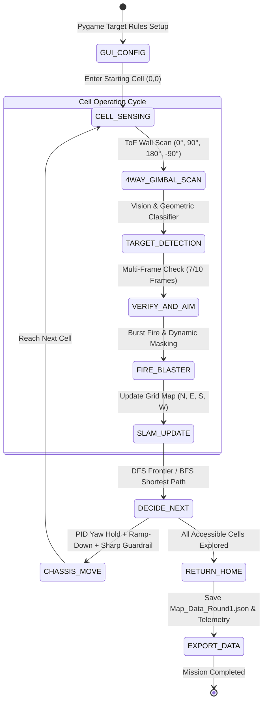
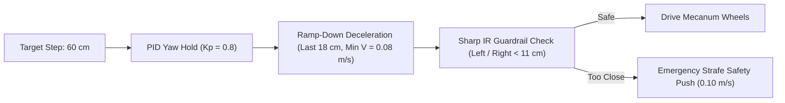

# คู่มือและรายงานทางเทคนิค: ระบบสำรวจเขาวงกต ทำแผนที่ SLAM และยิงเป้าหมายอัตโนมัติรอบที่ 1 (Round 1 Autonomous Exploration & Firing)

เอกสารฉบับนี้จัดทำขึ้นเพื่ออธิบายสถาปัตยกรรมระบบ โค้ดโปรแกรม อัลกอริทึมการนำทาง SLAM และระบบประมวลผลการยิงเป้าหมายอัตโนมัติในไฟล์ `Report_final/Run1/run_round1.py` สำหรับการแข่งขัน **RoboMaster EP Maze Competition (Round 1)**

---

## 1. ภาพรวมของภารกิจรอบที่ 1 (Round 1 Mission Scope)

ภารกิจรอบที่ 1 มีเป้าหมาย 3 ประการหลัก:
1. **สำรวจเขาวงกต (Maze Exploration)**: หุ่นยนต์เริ่มต้นจากจุด $(0, 0)$ เคลื่อนที่สำรวจทุกช่องของสนามกริดขนาดช่องละ $60 \times 60\text{ cm}$
2. **สร้างแผนที่ดิจิทัล (Digital SLAM Mapping)**: ตรวจจับกำแพง 4 ทิศทาง (North, East, South, West) และบันทึกลงไฟล์ `Map_Data_Round1.json`
3. **ตรวจจับและยิงเป้าหมายทั้งหมด (Target Recognition & Knockdown)**: ระบุรูปทรงและสีของเป้าหมายบนกำแพง เล็งยิงเป้าหมายที่ตรงตามกติกาให้ล้มทั้งหมด และบันทึกพิกัดเป้าหมายลงแผนที่เพื่อใช้ในรอบที่ 2 (Round 2 Shortest Path Firing)
4. **นำทางกลับจุดเริ่มต้น (Return to Home)**: เมื่อสำรวจครบทุกช่อง หุ่นยนต์จะคำนวณเส้นทางที่สั้นที่สุดกลับมายังจุดเริ่มต้น $(0, 0)$ โดยอัตโนมัติ



---

## 2. โครงสร้างไฟล์ในโฟลเดอร์ `Run1`

| ชื่อไฟล์ | บทบาทหน้าที่ |
|:---|:---|
| `run_round1.py` | โค้ดหลักความยาวกว่า 2,000 บรรทัด รวมระบบ SLAM, นำทาง, Visual Servoing, Firing, Sharp Guardrail, Telemetry และ Pygame Dashboard |
| `hsv_config.json` | ฐานข้อมูลช่วงค่าสี HSV ที่ผ่านการปรับเทียบแล้ว |
| `tof_calib_params.json` | พารามิเตอร์สมการปรับเทียบระยะ ToF ($y = ax^2 + bx + c$) |
| `calibration_sharp_poly.json` | พารามิเตอร์แปลงแรงดัน ADC เป็นระยะทางของเซนเซอร์ Sharp ซ้าย/ขวา |
| `distance_calib_params.json` | สัมประสิทธิ์การชดเชยระยะก้าวเดิน $60\text{ cm}$ ของ Chassis |

---

## 3. สถาปัตยกรรมระบบและการทำงานเชิงลึก (Detailed System Architecture)

---

### 3.1 ระบบโครงสร้างกริดและการสร้างแผนที่ (Grid Map Representation)

สนามถูกแบ่งออกเป็นตารางพิกัดแบบ 2 มิติ $(g_x, g_y)$ โดยมีขนาดช่องละ $60 \times 60\text{ cm}$:
- **ทิศทางการหัน (Heading)**: กำหนด $0^\circ = \text{North (+Y)}$, $90^\circ = \text{East (+X)}$, $180^\circ = \text{South (-Y)}$, $-90^\circ = \text{West (-X)}$
- **โครงสร้างข้อมูลของแต่ละ Cell ในแผนที่**:
```json
{
    "visited": true,
    "walls": {
        "N": true,
        "E": false,
        "S": false,
        "W": true
    },
    "targets": [
        {
            "wall_direction": "N",
            "shape": "CIRCLE",
            "color": "red",
            "status": "SHOT"
        }
    ]
}
```

---

### 3.2 การตรวจจับกำแพง 4 ทิศทางด้วย Gimbal ToF (4-Way Wall Scanning)

เมื่อหุ่นยนต์เคลื่อนที่เข้าสู่ใจกลางช่องกริด Gimbal จะทำการหมุนสแกน 4 ทิศทางตามลำดับสัมพันธ์กับทิศหุ่นยนต์ (Relative: Ahead $0^\circ$, Right $90^\circ$, Back $180^\circ$, Left $-90^\circ$):
1. **การแปลงทิศสัมพันธ์เป็นทิศสัมบูรณ์ (Global Cardinal Direction)**:
   $$\text{Global Direction} = (\text{Current Heading} + \text{Gimbal Yaw}) \pmod{360}$$
2. **เกณฑ์การตัดสินกำแพง (Wall Threshold)**:
   - หากระยะ ToF $\le 52.0\text{ cm}$ (`WALL_THRESHOLD_CM`) $\rightarrow$ ถือว่า **มีกำแพง** ในทิศทางนั้น
   - หากระยะ ToF $> 52.0\text{ cm}$ $\rightarrow$ ถือว่า **เป็นทางโล่ง** (Open Path)
3. **การซิงค์แผนที่ 2 ทิศทาง (Mutual Wall Synchronization)**:
   เมื่อตรวจพบกำแพงด้าน North ของช่อง $(x, y)$ ระบบจะอัปเดตกำแพงด้าน South ของช่อง $(x, y+1)$ ให้เป็นกำแพงด้วยอัตโนมัติ

---

### 3.3 อัลกอริทึมการสำรวจและการค้นหาเส้นทาง (Exploration & Pathfinding)

1. **Depth-First Search (DFS) with Frontier Priority**:
   หุ่นยนต์จะเลือกเดินไปยังช่องเพื่อนบ้านที่ยังไม่เคยสำรวจ (`unvisited`) โดยเรียงลำดับความสำคัญตามทิศทางข้างหน้าก่อนเพื่อลดการหมุนตัว
2. **Breadth-First Search (BFS) for Dead-End Backtracking**:
   เมื่อเดินไปพบทางตัน (Dead-end) ที่ไม่มีช่องติดกันให้สำรวจต่อ ระบบจะใช้ **BFS Shortest Path Algorithm** คำนวณหาลำดับก้าวเดินที่สั้นที่สุดเพื่อถอยกลับไปยังช่องสำรวจที่เปิดค้างอยู่ (Frontier Cell)
3. **Shortest Path Return to Base $(0, 0)$**:
   เมื่อสำรวจครบทุกช่องที่สามารถเข้าถึงได้ ระบบจะใช้ BFS วิ่งกลับจุดเริ่มต้น $(0, 0)$ อย่างรวดเร็ว

---

### 3.4 การควบคุมการเคลื่อนที่และการป้องกันการชน (Chassis Motion & Guardrail)



1. **PID Yaw Holding**: ล็อคมุมการวิ่งด้วยไจโรสโคป (IMU Attitude) ป้องกันล้อ Mecanum ดริฟท์เบนออกจากแนวแกน
2. **Ramp-Down Deceleration Profile**: เมื่อเคลื่อนที่เข้าใกล้เป้าหมายในระยะ $18\text{ cm}$ สุดท้าย ระบบจะชะลอความเร็วลงสู่ $\text{MIN\_V} = 0.08\text{ m/s}$ และสั่ง Active Brake เมื่อถึงจุดหมาย
3. **Sharp IR Side-Wall Guardrail**:
   - เซนเซอร์อินฟราเรดด้านข้างซ้าย-ขวาจะคอยตรวจจับระยะห่างจากกำแพงแบบ Real-time
   - หากระยะ $\le 11.0\text{ cm}$ (`SHARP_PUSH_DIST_CM`) ระบบจะสั่ง Strafe ขับสไลด์ออกห่างจากกำแพงด้านนั้นทันที ($\text{Speed} = 0.10\text{ m/s}$) เพื่อป้องกันตัวหุ่นชนหรือครูดกับกำแพง

---

### 3.5 ระบบการตรวจจับและยิงเป้าหมายระหว่างการสำรวจ (Integrated Target Engagement)

ในทุก ๆ ด้านที่ตรวจพบกำแพง:
1. ปรับก้ม Gimbal Pitch ลงมาที่ $-22^\circ$ เพื่อให้เห็นเป้าหมายชัดเจน
2. กล้องประมวลผล HSV + Contour + Geometric Classifier
3. หากคู่สีและรูปทรงตรงกับ **Target Rules** ที่กำหนด:
   - ทำการยืนยันความแม่นยำ $7$ จาก $10$ เฟรม
   - สั่ง Closed-Loop Adaptive Gimbal Aiming
   - เมื่อเข้าจุดเล็งกึ่งกลาง ($\pm 18\text{ px}$) สั่งยิงกระสุนเจล $2$ นัด (`BURST_FIRE_COUNT`)
   - นำตำแหน่งเป้าหมายมาทำ **Dynamic ROI Masking** ป้องกันการเล็งซ้ำ
   - บันทึกภาพลงโฟลเดอร์ `detected_targets/`
4. ปรับ Gimbal Pitch กลับสู่ระนาบปลอดภัย $0^\circ$ (`SAFE_CLEARANCE_PITCH`) ก่อนหมุนไปยังทิศถัดไป

---

### 3.6 Real-Time Pygame Dashboard & Telemetry Visualization

ระหว่างที่หุ่นยนต์ปฏิบัติภารกิจ โปรแกรมจะเปิดหน้าต่าง Pygame Dashboard แสดงข้อมูลแบบ Real-time ประกอบด้วย:
- **Interactive Grid Map**: แสดงตาราง $60 \times 60\text{ cm}$, เส้นกำแพงสีขาว, ช่องที่สำรวจแล้ว (สีเขียวอ่อน), ตำแหน่งและหัวหุ่นยนต์ (ลูกศรทิศทาง), จุดเป้าหมายที่ตรวจพบและยิงล้มแล้ว
- **Live Telemetry Panel**: แสดงสถานะ พิกัด $(g_x, g_y)$, มุม Heading, ค่าระยะ ToF ทั้ง 4 ทิศ, ค่าระยะ Sharp IR ซ้าย-ขวา
- **Mission Event Logs**: กล่องข้อความแสดง Log ย้อนหลัง 6 รายการล่าสุด

---

## 4. ผลลัพธ์และไฟล์ข้อมูลที่ได้หลังจบภารกิจ (Generated Outputs)

เมื่อสิ้นสุดการสำรวจ ระบบจะส่งออกไฟล์ข้อมูลอัตโนมัติ:

1. **`Map_Data_Round1.json`**:
   แผนที่เขาวงกตที่สมบูรณ์ พิกัดกำแพงทุกช่อง และตำแหน่งของเป้าหมายทั้งหมด เพื่อส่งต่อให้ระบบรอบที่ 2 ใช้งาน
2. **`exploration_telemetry.csv`**:
   บันทึกประวัติการเดินทุกก้าว เวลา พิกัด ค่า ToF 4 ทิศ และสถานะกำแพง สำหรับนำไปพล็อตวิเคราะห์ในรายงาน
3. **`exploration_log.txt`**:
   บันทึกข้อความเหตุการณ์ ข้อผิดพลาด และลำดับการตัดสินใจของ State Machine ทั้งหมด
4. **`detected_targets/`**:
   โฟลเดอร์เก็บภาพถ่ายเป้าหมายที่ตรวจพบและเล็งยิง

---

## 5. สรุปพารามิเตอร์สำคัญของระบบ (System Configuration Constants)

| พารามิเตอร์ | ค่าที่ตั้งไว้ | คำอธิบายการทำงาน |
|:---|:---:|:---|
| `CELL_SIZE_CM` | $60.0\text{ cm}$ | ขนาดของช่องตารางกริด |
| `WALL_THRESHOLD_CM` | $52.0\text{ cm}$ | ขีดจำกัดระยะ ToF ในการตัดสินว่ามีกำแพง |
| `AIM_ACCEPT_PX` | $18.0\text{ px}$ | ค่าความเผื่อความแม่นยำในการเล็งเป้าหมายก่อนสั่งยิง |
| `BURST_FIRE_COUNT` | $2$ | จำนวนลูกกระสุนที่ยิงใส่เป้าหมายในแต่ละครั้ง |
| `KP_YAW_HOLD` | $0.8$ | อัตราขยาย Proportional สำหรับคุมทิศทางการเดินให้ตรง |
| `DECEL_ZONE_M` | $0.18\text{ m}$ | ระยะเริ่มชะลอความเร็วก่อนถึงจุดกึ่งกลางช่อง |
| `SHARP_PUSH_DIST_CM`| $11.0\text{ cm}$ | ระยะฉุกเฉินสำหรับระบบ Guardrail ผลักหุ่นยนต์ออกจากกำแพง |
| `MAX_ROUND1_TIME_SEC`| $570.0\text{ s}$ | เวลาจำกัดสูงสุดในการวิ่งรอบที่ 1 ($9.5$ นาที) |
