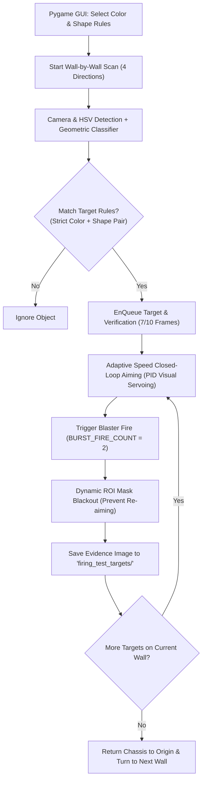

# คู่มือและรายงานทางเทคนิค: ระบบทดสอบการเล็งและยิงเป้าหมายจำลอง (Target Mock & Firing Module)

เอกสารฉบับนี้อธิบายการออกแบบเชิงสถาปัตยกรรม อัลกอริทึมการเล็งเป้าแบบแปรผันความเร็ว (Adaptive Speed Aiming) ระบบ Dynamic ROI Masking และอินเตอร์เฟซ Pygame GUI ในโฟลเดอร์ `Report_final/Target_mock` (ไฟล์ `test_firing_mock.py`)

---

## 1. ภาพรวมและวัตถุประสงค์ (System Overview)

โปรแกรม `test_firing_mock.py` ถูกพัฒนาขึ้นเพื่อจำลองและทดสอบกระบวนการค้นหา ยืนยัน เล็ง และยิงเป้าหมายอัตโนมัติแบบครบวงจร (Complete Firing Pipeline) บนกำแพง 4 ทิศทาง ($0^\circ, 90^\circ, 180^\circ, -90^\circ$) ก่อนนำไปผสานรวมกับระบบนำทางอัตโนมัติใน Round 1



---

## 2. โครงสร้างไฟล์ในโฟลเดอร์ `Target_mock`

| ชื่อไฟล์ | บทบาทและคำอธิบาย |
|:---|:---|
| `test_firing_mock.py` | สคริปต์หลักสำหรับระบบทดสอบการยิงเป้าหมาย ประกอบด้วย GUI กำหนดกฎกติกา, ระบบเล็ง Gimbal Visual Servoing, Dynamic Masking และการบันทึก Log |
| `hsv_config.json` | ฐานข้อมูลค่าขอบเขตสี (HSV Bounds) ที่ใช้ร่วมกับระบบกล้อง |
| `tof_calib_params.json` | สัมประสิทธิ์การปรับเทียบระยะ ToF เพื่อวัดระยะห่างระหว่างหุ่นยนต์กับกำแพงเป้าหมาย |

---

## 3. ฟีเจอร์หลักและการทำงานเชิงลึก (Core Features & Algorithms)

---

### 3.1 Pygame Interactive Rule Configurator (เมทริกซ์กำหนดกติกาเป้าหมาย)

ก่อนเริ่มต้นการทำงาน ระบบจะแสดงหน้าต่าง GUI ให้ผู้ใช้สามารถคลิกเลือกรูปแบบ **"คู่สีและรูปทรง"** ที่ต้องการให้หุ่นยนต์ยิง เช่น:
- สีแดง + วงกลม (`red: CIRCLE`)
- สีน้ำเงิน + สี่เหลี่ยมผืนผ้าแนวนอน (`blue: RECT_H`)

```
[Pygame Setup Window]
Target Selection Matrix (4x4 Grid):
            RECT_V    RECT_H    SQUARE    CIRCLE
RED        [  ✓  ]   [     ]   [     ]   [  ✓  ]
YELLOW     [     ]   [  ✓  ]   [     ]   [     ]
GREEN      [     ]   [     ]   [  ✓  ]   [     ]
BLUE       [  ✓  ]   [     ]   [     ]   [     ]
            [ START MISSION / EXECUTE ]
```
> **Strict Matching Principle**: ระบบจะไม่ยิงเป้าหมายที่มีสีตรงแต่รูปทรงไม่ตรง หรือรูปทรงตรงแต่สีไม่ตรง เพื่อความถูกต้อง $100\%$ ตามโจทย์การแข่งขัน

---

### 3.2 Adaptive Speed Aiming (ระบบเล็งเป้าแปรผันความเร็วตามระยะคลาดเคลื่อน)

การเคลื่อนที่ของ Gimbal ใช้หลักการ **Visual Servoing** แบบควบคุมวงปิด (Closed-Loop Proportional Control):

1. **คำนวณตำแหน่งคลาดเคลื่อนบนหน้าจอ (Pixel Error)**:
   $$e_x = x_{\text{target\_center}} - x_{\text{screen\_center}}$$
   $$e_y = y_{\text{target\_center}} - (y_{\text{screen\_center}} - \text{AIM\_Y\_OFFSET\_PX})$$
   *(โดย $\text{AIM\_Y\_OFFSET\_PX} = 32\text{ px}$ เป็นการชดเชยวิถีกระสุนเจลตกตามแรงโน้มถ่วง)*

2. **เกณฑ์การปรับความเร็ว Gimbal (Speed Adaptive Tier)**:
   - หากความคลาดเคลื่อนรวม $E = \sqrt{e_x^2 + e_y^2} > 120\text{ px}$:
     ใช้ความเร็วสูง $\text{Speed} = 540^\circ/\text{s}$ (`GIMBAL_FAST_SPEED`)
   - หาก $50\text{ px} < E \le 120\text{ px}$:
     ใช้ความเร็วปานกลาง $\text{Speed} = 320^\circ/\text{s}$ (`GIMBAL_MEDIUM_SPEED`)
   - หาก $E \le 50\text{ px}$:
     ใช้ความเร็วละเอียด $\text{Speed} = 140^\circ/\text{s}$ (`GIMBAL_SLOW_SPEED`) เพื่อป้องกันอาการสั่นเลยจุดเป้าหมาย (Overshooting)

3. **เงื่อนไขยอมรับการเล็ง (Aim Acceptance)**:
   เมื่อ $|e_x| \le 18\text{ px}$ และ $|e_y| \le 18\text{ px}$ ต่อเนื่องกัน ระบบจะสั่งยิงลูกเจลทันที (`BURST_FIRE_COUNT = 2`)

---

### 3.3 Dynamic ROI Masking (การบล็อกพื้นที่เป้าที่ยิงแล้ว)

เพื่อแก้ปัญหาเมื่อเป้าหมายถูกยิงล้มแล้ว กล้องยังอาจตรวจพบเศษสีเดิมและสั่งเล็งซ้ำ:
1. เมื่อกระสุนถูกยิงออกไปแล้ว ระบบจะคำนวณกรอบ Bounding Box ของเป้าหมายนั้น
2. ทำการขยายกรอบ Bounding Box ด้วย Margin ปลอดภัย $+15\text{ px}$
3. สั่งถมสีดำ ($\text{Pixel Value} = 0$) ลงใน Array ของ `roi_mask` แบบ Real-time ทันที
4. ทำให้ในเฟรมถัดไป อัลกอริทึมจะไม่เห็นและไม่จับเป้าหมายที่ตำแหน่งเดิมอีกตลอดการทำงานของกำแพงนั้น

---

### 3.4 Wall Cut-off Resolution & Chassis Retreat Maneuver (การถอยร่นเพื่อเปิดมุมมอง)

กรณีที่หุ่นยนต์อยู่ชิดกำแพงมากเกินไป จนกล้องก้มมองไม่เห็นเป้าหมายด้านล่าง:
1. วัดระยะ ToF ไปยังกำแพง หากพบว่าใกล้กว่า WALL_THRESHOLD_CM ($110\text{ cm}$ เยอะไปสำหรับ 1 ช่อง ควรใช้ค่าประมาณ 40 - 50 cm จากขนาดแมพที่ 60 * 60 และการก้มของ Gimbal ที่ทำให้ ToF วัดค่าได้ไกลขึ้น)
2. สั่งปรับระดับ Pitch ของ Gimbal ลงมาที่ $-22^\circ$ (`WALL_DOWN_PITCH`) เพื่อกวาดหาเป้าหมาย
3. หากเป้าหมายถูกตัดขอบ (Cut-off) หรือระยะไม่พอ หุ่นยนต์จะสั่ง Chassis ถอยหลัง (Retreat) ชั่วคราว
4. ทำการยิงเป้าหมายจนเสร็จสิ้น
5. **Chassis Return**: หุ่นยนต์จะขับเคลื่อนกลับมายังตำแหน่งพิกัดจุดศูนย์กลางเดิม ก่อนที่จะหมุน Gimbal ไปยังกำแพงทิศทางถัดไป เพื่อป้องกันข้อผิดพลาดสะสมของพิกัด

---

### 3.5 Frame Verification & Evidence Logging

- **Multi-Frame Confidence Filter**: ต้องตรวจจับเป้าหมายเดิมตรงกันอย่างน้อย 7 จาก 10 เฟรม (`REQUIRED_MATCH_FRAMES = 7`) จึงจะอนุมัติให้เข้าคิวยิง
- **Image Archiving**: เมื่อยิงเป้าสำเร็จ ระบบจะบันทึกภาพหลักฐานพร้อมกรอบ Bounding Box ลงในโฟลเดอร์ `firing_test_targets/` (เช่น `target_red_CIRCLE_14-35-12.jpg`)
- **Logging Telemetry**: บันทึกเหตุการณ์ เวลา ความคลาดเคลื่อน และจำนวนกระสุนลงใน `firing_test_log.txt`

---

## 4. ขั้นตอนการรันและการทดสอบระบบ (Execution Guide)

1. วางหุ่นยนต์ในพื้นที่ทดสอบหน้ากำแพงจำลอง
2. รันสคริปต์ผ่านเทอร์มินัล:
   ```bash
   python test_firing_mock.py
   ```
3. บนหน้าต่าง **Pygame GUI Setup**:
   - คลิกเครื่องหมายถูก `[✓]` เลือกคู่สีและรูปทรงที่ต้องการให้ยิง
   - กดปุ่ม **START MISSION**
4. สังเกตการทำงานบนหน้าต่าง OpenCV:
   - สังเกตกรอบ Target Bounding Box
   - เส้น Crosshair การเล็ง และแถบสถานะการยิง
   - แถบแสดง Dynamic Masking สีดำที่ปิดทับเป้าที่ยิงแล้ว
