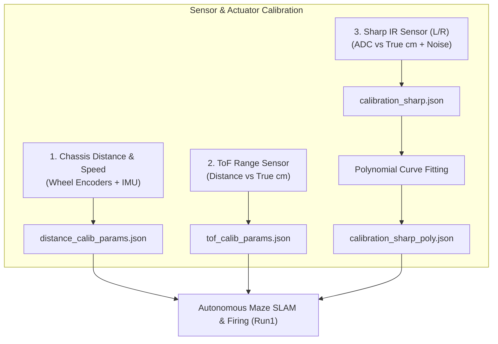

# คู่มือและรายงานทางเทคนิค: ระบบ Calibration เซนเซอร์และระบบขับเคลื่อน (Calibration Module)

เอกสารฉบับนี้จัดทำขึ้นเพื่ออธิบายหลักการทำงาน รายละเอียดโครงสร้างโค้ด สมการทางคณิตศาสตร์ และขั้นตอนการใช้งานของชุดโปรแกรมในโฟลเดอร์ `Report_final/calibration` สำหรับนำไปใช้ประกอบการเขียนรายงานทางวิศวกรรมและการแข่งขัน **RoboMaster EP**

---

## 1. ภาพรวมของระบบ Calibration (System Overview)

เพื่อให้หุ่นยนต์สามารถเคลื่อนที่ในช่องกริดเขาวงกตขนาด $60 \times 60\text{ cm}$ ตรวจจับกำแพง และเล็งยิงเป้าหมายได้อย่างแม่นยำ จำเป็นต้องทำการปรับเทียบ (Calibration) ฮาร์ดแวร์ 3 ส่วนหลัก:



---

## 2. โครงสร้างไฟล์ในโฟลเดอร์ `calibration`

| ลำดับ | ชื่อไฟล์ | บทบาทและหน้าที่สำคัญ |
|:---:|:---|:---|
| 1 | `calibrate_distance.py` | ปรับเทียบระยะการเคลื่อนที่ของ Chassis ขนาด 60 cm พร้อมระบบ PID Yaw Hold และ Ramp-down Deceleration |
| 2 | `calibration_ToF.py` | ปรับเทียบเซนเซอร์ ToF ในช่วงระยะ 10–180 cm ด้วยสมการพหุนามกำลังสอง (Quadratic Fit) |
| 3 | `sharp_calibration.py` | เครื่องมือเก็บข้อมูลดิบ ADC จากเซนเซอร์ Sharp IR ฝั่งซ้าย-ขวา และวัดระดับ Noise ในที่โล่ง |
| 4 | `sharp_data_poly.py` | สคริปต์คำนวณ Fitting สมการพหุนามกำลังสอง $y = ax^2 + bx + c$ จากไฟล์ LUT แปลงเป็นพารามิเตอร์พร้อมใช้งาน |
| 5 | `sharp_check.py` | เครื่องมือทดสอบสแกน ID และ Port ของ Sensor Adaptor แบบ Real-time |
| 6 | `Sharp_test.py` | คลาส `SharpPolyReader` สำหรับอ่านค่า ADC และแปลงเป็นระยะทางจริง (cm) ในการประมวลผลแบบ Online |
| 7 | `tof_calib_params.json` | ไฟล์พารามิเตอร์สำหรับเซนเซอร์ ToF (สัมประสิทธิ์ $a, b, c, R^2$) |
| 8 | `calibration_sharp.json` | ข้อมูลดิบ LUT (Look-Up Table) และ Noise Threshold ของ Sharp IR |
| 9 | `calibration_sharp_poly.json` | สัมประสิทธิ์สมการกำลังสองของ Sharp IR ซ้ายและขวา |

---

## 3. รายละเอียดเชิงลึกของโค้ดแต่ละโมดูล (Detailed Code Explanation)

---

### 3.1 `calibrate_distance.py` (การปรับเทียบระยะการเดินของล้อ)

#### วัตถุประสงค์
ปรับเทียบอัตราการหมุนของล้อ Mecanum และ Encoders ให้วิ่งได้ระยะทางจริงตรงกับความยาวกริด $60\text{ cm}$ ต่อ 1 ก้าว พร้อมชดเชยอาการดริฟท์และการลื่นไถล (Wheel Slip)

#### หลักการทำงานและอัลกอริทึม
1. **Feedback Loops**:
   - ดึงพิกัดตำแหน่ง $(x, y)$ ผ่าน `ep_chassis.sub_position(freq=20)`
   - ดึงมุมการหมุน Yaw ผ่าน `ep_chassis.sub_attitude(freq=20)`
2. **PID Heading Control**:
   ควบคุมทิศทางให้หุ่นยนต์วิ่งตรงแนวเดิม $0^\circ$ ไม่เอียงเฉ:
   $$\text{Error}_{\theta} = \text{Normalize}(\text{Target\_Yaw} - \text{Current\_Yaw})$$
   $$z_{\text{speed}} = \text{clamp}(K_p \cdot e + K_i \cdot \int e\,dt + K_d \cdot \frac{de}{dt}, -30.0, 30.0)$$
   *(โดยค่า Gain ที่กำหนด: $K_p=1.2, K_i=0.05, K_d=0.1$)*
3. **Ramp-Down Profile**:
   เมื่อเดินทางถึงระยะ $85\%$ ของระยะทางเป้าหมาย ระบบจะลดความเร็วลงเหลือ $0.10\text{ m/s}$ เพื่อลดแรงเฉื่อยและการลื่นไถล
4. **Active Braking**:
   สั่งหยุดนิ่ง `drive_wheels(0, 0, 0, 0)` ทันทีเมื่อถึงระยะ
5. **การคำนวณ Calibration Factor**:
   $$\text{Factor} = \frac{60.0\text{ cm}}{\text{Average Measured Distance (cm)}}$$
   บันทึกผลลงใน `distance_calib_params.json` ตามความเร็วเป้าหมาย

---

### 3.2 `calibration_ToF.py` (การปรับเทียบเซนเซอร์วัดระยะ ToF)

#### วัตถุประสงค์
แก้ไขค่าความคลาดเคลื่อนแบบไม่เชิงเส้น (Non-linear error) ของเซนเซอร์ Time-of-Flight ที่ติดอยู่บน Gimbal สำหรับตรวจจับกำแพงในระยะ $10 - 180\text{ cm}$

#### กระบวนการประมวลผล
1. ผู้ใช้กำหนดระยะจริง $y_{\text{real}} \in [10, 15, 20, 25, 30, 40, 50, 60, 80, 100, 120, 150, 180]\text{ cm}$
2. ทำการสุ่มอ่านค่าจาก ToF จำนวน 100 ตัวอย่างต่อระยะ แล้วคำนวณค่ามัธยฐาน ($\text{Median}$) เพื่อกรองสัญญาณรบกวน
3. **Quadratic Polynomial Fitting**:
   $$y_{\text{real}} = a \cdot x_{\text{raw}}^2 + b \cdot x_{\text{raw}} + c$$
4. คำนวณค่าสัมประสิทธิ์การตัดสินใจ ($R^2$ Score):
   $$R^2 = 1 - \frac{\sum (y_{\text{real}} - y_{\text{pred}})^2}{\sum (y_{\text{real}} - \bar{y}_{\text{real}})^2}$$
5. บันทึกผลลัพธ์ลงใน `tof_calib_params.json` โดยรองรับทั้งรูปแบบ Polynomial ($a, b, c$) และ Linear ($slope, intercept$) เพื่อ Backward Compatibility

---

### 3.3 `sharp_calibration.py` และ `sharp_data_poly.py` (การปรับเทียบ Sharp IR Sensor)

#### วัตถุประสงค์
แปลงค่าแรงดันไฟฟ้าสัญญาณอนาล็อก (ADC: 0–1023) จากเซนเซอร์ Sharp Infrared เป็นระยะทางจริง ($5 - 30\text{ cm}$) ซึ่งติดตั้งอยู่ด้านหน้าซ้าย (ID: 2, Port: 1) และหน้าขวา (ID: 1, Port: 1)

#### ฟังก์ชันการทำงาน
1. **Mode 4: Open Space Noise Baseline**:
   วัดค่า ADC ในพื้นที่โล่งเพื่อหาขีดจำกัด Noise Threshold:
   $$\text{Threshold}_{\text{Noise}} = \text{Max}(\text{ADC}_{\text{noise}}) + 15$$
2. **Mode 1–3: Look-Up Table (LUT) Acquisition**:
   บันทึกค่า ADC เฉลี่ยที่ระยะ $5, 10, 15, 20, 25, 30\text{ cm}$
3. **Polynomial Transformation (`sharp_data_poly.py`)**:
   แปลงคู่ลำดับ $[(\text{ADC}_1, d_1), (\text{ADC}_2, d_2), \dots]$ ให้เป็นสมการกำลังสอง:
   $$d_{\text{cm}} = a_{\text{sharp}} \cdot \text{ADC}^2 + b_{\text{sharp}} \cdot \text{ADC} + c_{\text{sharp}}$$
   บันทึกผลลง `calibration_sharp_poly.json`

---

### 3.4 `sharp_check.py` & `Sharp_test.py` (การทดสอบและใช้งาน Online)

- **`sharp_check.py`**: ลูปอ่านค่า ADC ของทุก Adapter ID (1–2) และ Port (1–2) เพื่อตรวจสอบการต่อสายฮาร์ดแวร์
- **`Sharp_test.py` (`SharpPolyReader`)**: คลาสมาตรฐานที่ใช้ในระบบหลัก:
  - ถ้า $\text{ADC} < \text{Noise Threshold}$ หรือ $\text{ADC} \le 0$ $\rightarrow$ คืนค่า $30.0\text{ cm}$ (ไม่มีสิ่งกีดขวาง/อยู่นอกระยะ)
  - ถ้า $\text{ADC} > \text{Max ADC}$ $\rightarrow$ คืนค่า $5.0\text{ cm}$ (ชิดวัตถุมากเกินไป)
  - นอกนั้นคำนวณผ่าน $y = ax^2 + bx + c$ พร้อม $\text{clip}(5.0, 30.0)$

---

## 4. โครงสร้างข้อมูลคอนฟิก (JSON Schemas)

### `tof_calib_params.json`
```json
{
    "model_type": "quadratic",
    "a": 0.000125,
    "b": 0.985400,
    "c": -0.4500,
    "slope": 0.9854,
    "intercept": -0.4500,
    "r_squared": 0.9992,
    "max_calib_range_cm": 180.0,
    "timestamp": "2026-03-15 14:30:00"
}
```

### `calibration_sharp_poly.json`
```json
{
    "LEFT_SENSOR": {
        "a": 0.00004512,
        "b": -0.06541200,
        "c": 38.54120000,
        "min_adc": 120,
        "max_adc": 850,
        "noise_threshold": 135
    },
    "RIGHT_SENSOR": {
        "a": 0.00004380,
        "b": -0.06321000,
        "c": 37.98210000,
        "min_adc": 118,
        "max_adc": 845,
        "noise_threshold": 133
    }
}
```

---

## 5. ขั้นตอนและคำแนะนำในการ Calibration ก่อนการแข่งขัน (Pre-run Checklist)

1. **Sharp IR ID & Port Check**:
   รัน `python sharp_check.py` ขยับมือหน้าเซนเซอร์ซ้าย-ขวาเพื่อยืนยันพอร์ต
2. **Sharp IR Noise & LUT**:
   รัน `python sharp_calibration.py` (เลือกโหมด 4 แล้วเลือกโหมด 3) จากนั้นรัน `python sharp_data_poly.py`
3. **ToF Distance Calibration**:
   รัน `python calibration_ToF.py` เล็งหุ่นยนต์ตรงใส่กำแพงตามระยะตลับเมตร
4. **Chassis Step 60 cm Calibration**:
   รัน `python calibrate_distance.py` ทดสอบวิ่ง 3 รอบ และกรอกระยะจริงเพื่อบันทึก `distance_calib_params.json`
